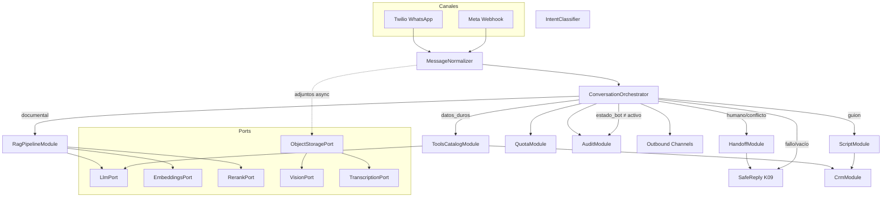
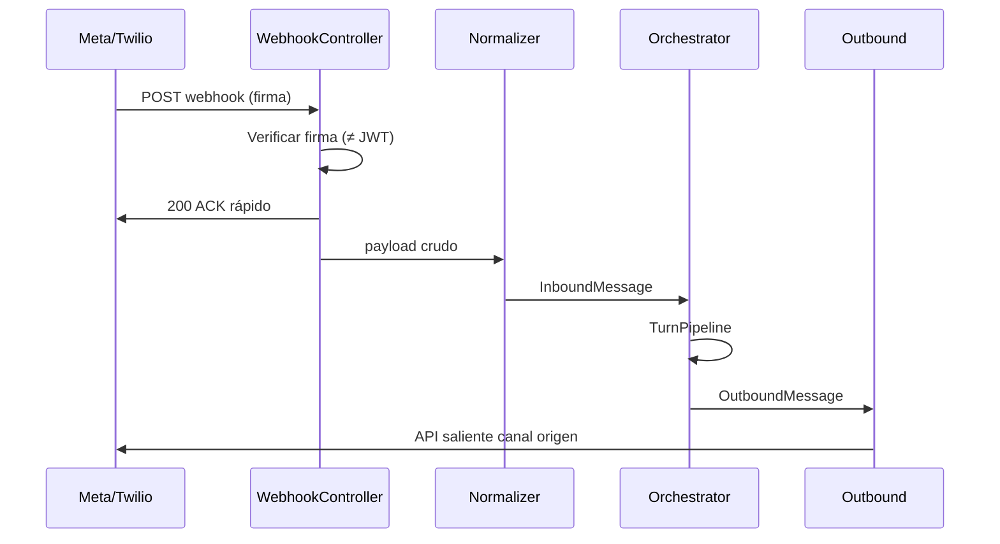
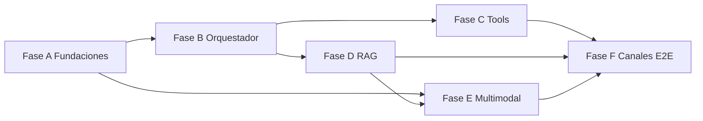

# Plan de implementación — Chatbot Agentic RAG (backend)

Plan de **ejecución** del cerebro conversacional del Event Master System (Tres Cielos). Este documento traduce los contratos de Fase Doc (`02`–`09`) en fases ordenadas, módulos NestJS, endpoints sandbox, PRs y criterios binarios de cierre. **No implementa código**; el código en `apps/` permanece bloqueado conceptualmente hasta cerrar Fase Doc y arrancar por las fases de aquí.

**Decisiones de producto fijadas (no renegociar en PRs):**

| Decisión | Valor |
|---|---|
| Stack | NestJS + Prisma + PostgreSQL (pgvector + FTS) |
| LLM / embeddings / Vision / Whisper | **SDK oficial OpenAI** (`openai` Node) — **prohibido** Vercel AI SDK y Assistants API |
| Rerank | Cohere Rerank, umbral default **0.85** |
| Montos | **Solo** tools Prisma; nunca OCR / Vision / Whisper / RAG |
| Multimodal | PDF, Word, XLS, foto, video (object storage obligatorio) |
| Routing | guion → handoff forzado → catálogo → RAG → safe |
| Memoria | Nuestra DB + cola; no threads del vendor |

---

## 1. Objetivo y definición de “chatbot robusto”

### 1.1 Objetivo

Entregar un único cerebro conversacional multi-canal (Meta Messenger/Instagram + Twilio WhatsApp) que, por cada mensaje del prospecto:

1. Avance el **guion** de precalificación cuando corresponda.
2. Resuelva **datos duros** (precio, paquete, inclusiones, reglas) solo con **tools Prisma**.
3. Resuelva **FAQ / políticas / narrativa** solo con **hybrid search + Cohere ≥ 0.85 + LLM estricto + cita tipada**.
4. Escalone a humano con motivos tipificados y deje de responder el hilo.
5. Deje **telemetría auditable** (`EventoOperativo`, `RegistroRecuperacion`, `RegistroConsultaCatalogo`) y contabilice cupo.

No es un agente autónomo multi-día, ni negociador de descuentos, ni emisor de PDF contractual.

### 1.2 Definición operativa de “robusto”

El chatbot se considera robusto cuando cumple **simultáneamente**:

| Dimensión | Significado medible |
|---|---|
| **Precisión** | C3 = 0 montos inventados; C5 = respuestas RAG solo con rerank ≥ 0.85 y cita `[Fuente: … \| tipo: …]`; sin afirmar disponibilidad de fechas sin proceso humano |
| **Auditoría** | ≥1 `EventoOperativo` (actor `bot`) por mensaje saliente / decisión; drill-down a registros de recuperación/catálogo; `ruta` siempre presente |
| **Handoff** | Pedido de humano, rerank bajo, sin catálogo, sin cita, conflicto/queja, adjunto no soportado, fallo proveedor IA, cupo hard → `estado_bot = escalado` + safe copy (K09) + alerta SLA 15–30 min |
| **Multi-canal** | Misma lógica de turno tras normalización; reply por canal de origen; webhooks autenticados por **firma**, no JWT de panel |
| **Degradación segura** | Fallo OpenAI/Cohere/storage/cupo → safe + handoff; **nunca** inventar FAQ ni precios |
| **Frescura** | Solo fragmentos de versión publicada + `pipelineEstado = listo`; invalidación inmediata al archivar |

### 1.3 Fuera de alcance de este plan (v1)

Widget web, Google Ads, SMS masivo, email marketing, drips multi-día, scoring predictivo, SQL libre / browser tools, segundo vendor LLM, cotizar desde media.

---

## 2. Baseline — docs vs código actual

### 2.1 Contrato documental (completo / Fase Doc)

| Área | Docs | Estado |
|---|---|---|
| Dominios y routing | `01`, `02` | Cerrado |
| RAG + anti-alucinación | `03` | Cerrado |
| Ingesta K + multimodal | `04`, `08` | Cerrado |
| DTOs bot/tools/handoff/media | `05` | Cerrado |
| Guards; webhooks ≠ JWT | `06` | Cerrado |
| OpenAI + Cohere + ports | `07` | Cerrado |
| Aceptación D-MED / T-MED / D-BOT | `09`, setup/04 | Cerrado |
| Modelo + assets | database `01`, `03` | Cerrado |
| Estructura módulos Nest | setup/02 §2 | Objetivo documentado |

### 2.2 Código real en `apps/api` (julio 2026)

| Existe | No existe aún |
|---|---|
| `AppModule` = `ConfigModule` + `PrismaModule` + `HealthModule` + `CatalogSandboxModule` | LLM / embeddings / Vision / Whisper / Cohere |
| Health HTTP | `ConversationOrchestratorModule`, `ScriptModule`, `RagPipelineModule`, `HandoffModule` |
| Tools de catálogo **sandbox** (`CatalogToolsService`: buscar, precio, inclusiones, comparar, reglas) | Orquestador, guion, routing de intents |
| Prisma parcial enfocado a **catálogo** sandbox | Modelo completo CRM / Conversacion / Mensaje / Fragmento / EventoOperativo |
| | `ChannelsModule` (Meta/Twilio) |
| | Ports `Llm` / `Embeddings` / `Rerank` / `Vision` / `Transcription` / `ObjectStorage` |
| | Worker de ingesta / MediaRouter / pgvector híbrido |
| | Auth JWT panel (webhooks tampoco) |

**Implicación:** el sandbox de catálogo es el **único** activo reutilizable del cerebro (promote a `ToolsCatalogModule`). Todo lo demás se construye en las fases A–F de este plan. No reescribir el contrato de tools; alinear nombres snake_case del orquestador (`buscar_paquetes`, etc.) al servicio existente.

### 2.3 Gap crítico a cerrar antes del primer PR de orquestador

1. Schema Prisma: entidades de conversación, CRM mínimo, conocimiento, auditoría (o migraciones incrementales por fase).
2. Extensión `pgvector` + columnas embedding + FTS (`tsvector`) en `FragmentoVectorial`.
3. Módulo `AiProvidersModule` con ports + fakes de CI.
4. Endpoint interno `POST /orchestrator/turn` (sandbox) **antes** de cablear webhooks reales.

---

## 3. Arquitectura NestJS del cerebro

### 3.1 Árbol objetivo bajo `apps/api/src/`

Alinear a setup/02 y orquestador §2; carpetas concretas:

```
apps/api/src/
├── main.ts
├── app.module.ts
├── config/                          # validación env (Zod/Joi): OpenAI, Cohere, S3, umbrales
├── common/                          # envelope, filters, @Public, CorrelationId
├── prisma/
├── health/
├── ports/                           # interfaces + tokens DI
│   ├── llm.port.ts
│   ├── embeddings.port.ts
│   ├── rerank.port.ts
│   ├── vision.port.ts
│   ├── transcription.port.ts
│   ├── object-storage.port.ts
│   └── __fakes__/                   # fakes deterministas CI
├── ai-providers/                    # AiProvidersModule — adapters OpenAI / Cohere / S3
│   ├── openai.llm.adapter.ts
│   ├── openai.embeddings.adapter.ts
│   ├── openai.vision.adapter.ts
│   ├── openai.transcription.adapter.ts
│   ├── cohere.rerank.adapter.ts
│   └── s3.storage.adapter.ts
├── channels/                        # ChannelsModule
│   ├── meta.webhook.controller.ts   # firma Meta — sin JWT
│   ├── twilio.webhook.controller.ts # firma Twilio — sin JWT
│   ├── message-normalizer.service.ts
│   ├── outbound.service.ts
│   └── attachments/                 # put storage + encolar MediaRouter (canal)
├── conversation/
│   ├── orchestrator/                # ConversationOrchestratorModule
│   │   ├── orchestrator.service.ts  # TurnPipeline
│   │   ├── intent-classifier.service.ts
│   │   ├── turn.controller.ts       # POST /orchestrator/turn (sandbox / interno)
│   │   └── routing.policies.ts      # reglas §4 orquestador
│   ├── script/                      # ScriptModule — máquina de estados guion
│   └── handoff/                     # HandoffModule
├── tools-catalog/                   # ToolsCatalogModule (promote desde catalog-sandbox)
├── rag/                             # RagPipelineModule
│   ├── hybrid-search.service.ts
│   ├── rerank.service.ts
│   ├── generator.service.ts         # LlmPort + prompt estricto + validación cita
│   └── registro-recuperacion.service.ts
├── knowledge-ingestion/             # KnowledgeIngestionModule + MediaRouter
│   ├── media-router.service.ts
│   ├── parsers/                     # pdf, docx, xls, photo, video
│   ├── scrub/                       # tariff gate → no_recuperable_precio
│   └── jobs/
├── crm/                             # Lead, Oportunidad, brief, calificación
├── assignment/
├── notifications/
├── quota/                           # mensajería + tokens IA
├── audit/                           # EventoOperativo
├── catalog/                         # admin HTTP (separado de tools del bot)
├── catalog-sandbox/                 # legacy → deprecar tras migrate a tools-catalog
└── auth/                            # panel JWT (no aplica a webhooks ni turn sandbox interno)
```

### 3.2 Módulos Nest y responsabilidades

| Módulo | Carpeta | Responsabilidad |
|---|---|---|
| `AiProvidersModule` | `ai-providers/` + `ports/` | Registra adapters; exporta tokens `LLM_PORT`, `EMBEDDINGS_PORT`, `RERANK_PORT`, `VISION_PORT`, `TRANSCRIPTION_PORT`, `OBJECT_STORAGE_PORT` |
| `ChannelsModule` | `channels/` | Webhooks, normalización → `InboundMessage`, outbound, adjuntos canal |
| `ConversationOrchestratorModule` | `conversation/orchestrator/` | Router de turno; único entrypoint de decisión |
| `ScriptModule` | `conversation/script/` | Guion precalificación; sin RAG ni tools de precio |
| `ToolsCatalogModule` | `tools-catalog/` | Function calling → Prisma |
| `RagPipelineModule` | `rag/` | Hybrid + rerank ≥ 0.85 + generador + `RegistroRecuperacion` |
| `HandoffModule` | `conversation/handoff/` | `escalado`, safe K09, notificación, pausa bot |
| `KnowledgeIngestionModule` | `knowledge-ingestion/` | Biblioteca K + MediaRouter + jobs |
| `CrmModule` | `crm/` | Alta lead/opp, brief, `calificado` / `listo_para_cotizar` |
| `AssignmentModule` | `assignment/` | Enrutador sede → disponibilidad → RR |
| `NotificationsModule` | `notifications/` | Escalación / calificado |
| `QuotaModule` | `quota/` | Cupo mensajería + IA soft/hard |
| `AuditModule` | `audit/` | Persistencia `EventoOperativo` |
| `CatalogAdminModule` | `catalog/` | CRUD/import panel (no tools) |
| `HealthModule` | `health/` | Ya existe |

### 3.3 Ports (contrato mínimo)

| Port | Operaciones | Adapter prod | Fake CI |
|---|---|---|---|
| `LlmPort` | `complete`, `completeWithTools` | OpenAI SDK | Fixture por hash de prompt / tool plan fijo |
| `EmbeddingsPort` | `embedOne`, `embedBatch` | OpenAI embeddings | Vector determinista por hash |
| `RerankPort` | `rerank(query, passages[])` | Cohere | Tabla scores por id de pasaje |
| `VisionPort` | `describeOrExtractText` | OpenAI Vision | Golden por nombre fixture |
| `TranscriptionPort` | `transcribeAudio` | Whisper | Transcript golden |
| `ObjectStoragePort` | `put`, `get`, `signedUrl`, `delete` | S3-compatible | FS temp / MemoryStorage |

Reglas: el dominio **no** importa `openai` ni Cohere directamente. Fallo tipificado → safe + handoff (`proveedor_ia`). CI de PR **sin** llamadas reales.

### 3.4 Diagrama de arquitectura



---

## 4. Flujo por mensaje (detalle de estados)

### 4.1 Entrada normalizada

Todo canal produce un `InboundMessage` interno (DTO §4.2 de `05`):

- `canal`, `externalThreadId`, `externalMessageId`, `texto`, `recibidoEn`, `perfilCanal`
- `adjuntos[]?` → `storageKey` tras `ObjectStoragePort.put` (binario nunca en Postgres)

### 4.2 Máquina de decisión del turno

```
1. Resolver Conversacion (+ crear Lead/Oportunidad parcial si primer contacto)
2. Persistir Mensaje entrante (autor=prospecto)
3. Si estado_bot ∈ { escalado, humano } → solo registrar; NO llamar LLM; fin
4. QuotaModule: ¿hard limit IA? → Hand + safe (cupo_ia); fin
5. ¿Pedido humano / queja / toxicidad / conflicto? → Hand (solicitud_usuario|queja|conflicto)
6. Si hay adjuntos:
   - MIME/tamaño/duración OK? no → Hand (adjunto_no_soportado)
   - put storage + encolar job canal (async)
   - Si adjunto bloqueante (“cotiza con esta foto”) → esperar texto derivado (SLA) o Hand timeout
7. ¿Turno de captura del guion? → ScriptModule (sin RAG); actualizar campos_capturados
8. Clasificar intención (reglas + LlmPort ligero):
   A. datos_duros → gate no_recuperable_precio → ToolsCatalog → filas? redactar : Safe+Hand(sin_catalogo)
   B. documental → RagPipeline → rerank≥0.85 + cita? redactar : Safe+Hand(rerank_bajo|sin_cita_rag)
9. Post-turno: CrmModule.evalCalificacion / listo_para_cotizar
10. Quota + EventoOperativo (ruta, tools/rag, cupo, motivoHandoff, paso_guion)
11. Outbound por canal de origen
```

### 4.3 Estados de conversación

| Campo | Valores / uso |
|---|---|
| `estado_bot` | `activo` \| `escalado` \| `humano` |
| `paso_guion` | saludo → nombre → ocasión → fecha → aforo → sede → presupuesto → intención → faq_libre |
| `campos_capturados` | JSON alineado a DTO §5 |
| `paquete_tentativo_id` | SKU sugerido por tools |
| `ultima_ruta` | `guion` \| `catalogo` \| `rag` \| `handoff` \| `safe` |
| `motivo_handoff` | Enum cerrado (extender DTOs con: `adjunto_no_soportado`, `material_ocr_tarifas`, `proveedor_ia`, `cupo_ia` — hoy parcial en `05`) |

### 4.4 EventoOperativo (obligatorio)

Por cada decisión / mensaje saliente bot, payload mínimo:

- `ruta`, `cupo.{ unidadesMensajeria, tokensEstimados, usoAgenticRag }`
- `tools[]` si hubo (nombre, latenciaMs, ok, filasSku)
- `rag` si hubo (scoresRerank, umbral 0.85, fragmentoIds, fuentesCita, tipoMaterial, origenDerivacion)
- `motivoHandoff` si handoff
- `pasoGuion`, `calificacionResultado`, `listoParaCotizar` si evaluados
- FKs opcionales a `registroConsultaCatalogoId` / `registroRecuperacionId`

### 4.5 Cupo

- Mensajería: +1 unidad contabilizable al enviar saliente (reglas Anexo comercial).
- IA: tokens orquestador + generador + embedding query + unidades Cohere (+ Vision/Whisper si el turno los usó).
- Soft limit → alerta admin; hard limit → no inventar, solo safe/handoff.

---

## 5. Capas del orquestador

### 5.1 ScriptModule

- Máquina de estados / flujo aprobado (copy de bienvenida y preguntas).
- Validaciones: aforo entero, fecha razonable, sede activa.
- **Prohibido:** RAG, tools de precio, Vision síncrono en el webhook.
- Al completar obligatorios + intención → `CrmModule` marca `calificado` y dispara asignación/notificación.

### 5.2 Intent (clasificador)

- Entrada: texto + `paso_guion` + flags de adjunto + historial corto.
- Salida tipada: `guion_captura` \| `solicitud_humana` \| `datos_duros` \| `pregunta_documental` \| `ambiguo`.
- Implementación: reglas lexicales primero (“cuánto”, “precio”, “paquete”, “hablar con…”) + `LlmPort` si ambiguo.
- Si `ambiguo` y riesgo de monto → preferir tools o handoff; **nunca** RAG de precios.

### 5.3 ToolsCatalogModule

Tools registradas (único contrato con el LLM orquestador):

| Tool | Fuente |
|---|---|
| `buscar_paquetes` | Prisma `Paquete` publicado |
| `obtener_precio_paquete` | `PaquetePrecio` vigente |
| `listar_inclusiones` | `PaqueteInclusion` |
| `comparar_paquetes` | N SKUs |
| `evaluar_reglas_paquete` | `PaqueteRegla` |
| `transferir_a_humano` | Handoff explícito |

- Sin tool `ejecutar_sql`.
- Tras tool result: redactar **solo** con campos devueltos; incluir SKU; si `sin_precio_vigente` → no estimar.
- Persistir `RegistroConsultaCatalogo`; actualizar brief / `paquete_tentativo_id`.
- Promote: mover lógica de `catalog-sandbox/catalog-tools.service.ts` a este módulo; sandbox queda cliente de prueba o se depreca.

### 5.4 RagPipelineModule

Pipeline (solo rama documental):

1. Query rewrite opcional (sede / tipo evento del contexto).
2. Parallel: pgvector (`EmbeddingsPort`) + FTS español.
3. Filtros: fragmento activo, documento publicado, sede global|lead, `pipelineEstado=listo`.
4. Fusión/dedupe → top 10–20.
5. `RerankPort` (Cohere) — solo texto; umbral **0.85**.
6. Top 3–4 ≥ umbral → `LlmPort.complete` con system prompt estricto.
7. Validar cita `[Fuente: nombre | tipo: tipo_material]`; si falta → handoff `sin_cita_rag`.
8. Gate: si intención monetaria llegó aquí por error → no emitir montos; redirigir a tools.
9. Fragmentos `no_recuperable_precio`: prosa OK, montos no.
10. `RegistroRecuperacion` completo (query, candidatos, scores, fragmentos, cita, flags).

### 5.5 HandoffModule

1. `Conversacion.estado_bot = escalado` + timestamp + motivo.
2. Bot deja de responder.
3. Notificación prioritaria (panel ± email) ventana 15–30 min.
4. Mensaje safe K09 al lead.
5. `EventoOperativo` + opcional disparo Assignment (priorizar dueño vigente).

### 5.6 Safe

- Copy institucional aprobado (K09); sin datos inventados.
- Usado en: umbral, sin filas, sin cita, proveedor caído, cupo, adjunto inválido.
- Puede combinarse con handoff (casi siempre en v1).

---

## 6. Integración OpenAI + Cohere

### 6.1 Modelos y env (referencia `07`)

| Rol | Env | Ref. v1 |
|---|---|---|
| Orquestador + tools | `OPENAI_MODEL_ORCHESTRATOR` | `gpt-4.1-mini` |
| Generador RAG | `OPENAI_MODEL_GENERATOR` | `gpt-4.1-mini` |
| Embeddings | `OPENAI_EMBEDDING_MODEL` | `text-embedding-3-small` |
| Vision | `OPENAI_MODEL_VISION` | multimodal acordado |
| Whisper | `OPENAI_WHISPER_MODEL` | `whisper-1` |
| Rerank | `COHERE_RERANK_MODEL` + `RERANK_THRESHOLD=0.85` | Cohere Rerank |

Obligatorias full bot: `OPENAI_API_KEY`, `COHERE_API_KEY`. Caps: `AI_MAX_TOKENS_*`, `AI_REQUEST_TIMEOUT_MS`, `AI_MAX_RETRIES`, soft/hard cupo IA.

### 6.2 Tool schemas

- JSON Schema / OpenAI function definitions espejo de las 6 tools.
- Validar args en Nest antes de Prisma (`class-validator` / Zod shared).
- Respuestas de tool: shapes estables; errores `sin_paquete` / `sin_precio_vigente` tipificados (no strings libres al modelo sin código).

### 6.3 Prompts

| Prompt | Uso |
|---|---|
| System orquestador | Solo tools listadas; no inventar precios; invocar `transferir_a_humano` cuando aplique |
| System generador RAG | Solo fragmentos; cita obligatoria con tipo material; prohibido copiar tarifas de contexto; safe si no está en contexto |
| Vision | Describir venue/texto visible; listar montos solo para scrub, no para cotizar |
| Intent (si LLM) | Clasificar enum cerrado; no responder al lead |

### 6.4 Degradación

| Fallo | Acción |
|---|---|
| OpenAI timeout / 5xx | Safe + handoff `proveedor_ia`; reintentos solo transitorios (≤ `AI_MAX_RETRIES`) |
| Cohere down | **No** saltar al LLM con hybrid crudo → safe + handoff |
| Embedding down en query | Idem |
| Hard cupo IA | Safe + handoff `cupo_ia` + alerta |
| Dimensión embedding mismatch | Fallar job/turno; no mezclar modelos sin reindex |

---

## 7. Conocimiento multimodal en el turno del bot

### 7.1 Biblioteca K (publicado)

- El bot **no** lee binarios en el turno síncrono.
- Consume solo `FragmentoVectorial` activos derivados (texto nativo, Vision, Whisper) vía RagPipeline.
- Cita incluye `tipo_material` (`pdf` / `word` / `foto` / `video` / `faq`…).
- SLAs de publicación son de **ingesta** (texto &lt; 60 s, foto &lt; 90 s, video &lt; 5 min); el turno asume índice ya `listo`.

### 7.2 Adjunto de canal

- Path: webhook → storage → job MediaRouter → `texto_derivado` en contexto de turno / expediente.
- **No** auto-publica a K ni entra a hybrid search global.
- Si el lead pide cotizar desde foto con tarifas → scrub + tools o handoff (`material_ocr_tarifas`); **0** montos desde OCR.

### 7.3 Gate `no_recuperable_precio`

Aplicar políticas `02` §4.5 en Intent + Tools + Generator:

- Intención monetaria → siempre tools.
- RAG con solo fragmentos flageados en pregunta monetaria → tools/handoff.
- RAG narrativa con flag → prosa sin cifras de tarifa.

---

## 8. Canales — Meta / Twilio → reply



### 8.1 Reglas

| Tema | Regla |
|---|---|
| Auth | Firma Meta `X-Hub-Signature-256` / Twilio signature — **nunca** `AuthGuard` JWT |
| Idempotencia | Deduplicar `externalMessageId` |
| Unificación v1 | Un hilo por canal + oportunidad; vincular lead si identificador coincide |
| Ventana WA | Plantillas utility fuera de ventana (metadatos + envío cuando flujo lo requiera) |
| Sandbox | `POST /orchestrator/turn` bypass canal: body = `InboundMessage` sintético; header interno o `@Public` solo en `APP_ENV=dev` / token de servicio |
| Panel humano | `POST /conversaciones/:id/mensajes` con JWT + Ownership; bot no responde si `estado_bot ≠ activo` |

### 8.2 Controllers previstos

- `POST /webhooks/meta` — `ChannelsModule` (`@Public` + MetaSignatureGuard)
- `POST /webhooks/twilio/whatsapp` — TwilioSignatureGuard
- `POST /orchestrator/turn` — sandbox/interno (Fase B+); no expuesto a internet en prod sin mTLS/token
- Controllers de panel de conversación: fuera del MVP del cerebro pero necesarios para handoff E2E (Fase E/F)

---

## 9. Persistencia

### 9.1 Entidades mínimas del cerebro

| Entidad | Uso en turno |
|---|---|
| `Lead` / `Oportunidad` | Expediente; brief; calificación |
| `Conversacion` | `estado_bot`, `paso_guion`, `campos_capturados`, canal |
| `Mensaje` | Historial; dirección; autor; `ruta?` |
| `AdjuntoMensaje` + `Asset` | Media canal; `storage_key`; pipeline |
| `DocumentoFuente` + `FragmentoVectorial` | Índice K; flags multimodales |
| `RegistroRecuperacion` | Auditoría RAG |
| `RegistroConsultaCatalogo` | Auditoría tools |
| `EventoOperativo` | Telemetría |
| `Paquete*` | Tools |
| `ContadorUso` / cupo | Mensajería + IA |
| `Notificacion` | Escalación |

Detalle ER: [../database/01-modelo-conceptual.md](../database/01-modelo-conceptual.md), [../database/03-assets-y-fragmentos-multimodales.md](../database/03-assets-y-fragmentos-multimodales.md).

### 9.2 Índices conceptuales

- pgvector: `embedding <=> query` con filtros de publicación/sede.
- FTS: `tsvector` español sobre `FragmentoVectorial.texto`.
- Únicos: `(canal, external_message_id)`; conversación por `(canal, external_thread_id)` o FK oportunidad.

### 9.3 Transacciones

- Corte de versión documental (activar nuevos fragmentos / desactivar viejos) en la misma unidad lógica de publicación.
- Handoff: estado + mensaje safe + evento + notificación en orden fallable con compensación (evento siempre).

---

## 10. Fases de implementación (ordenadas)

Cada fase tiene **entregables binarios** (sí/no) y dependencias. Orden de PRs sugerido al final de cada fase.

### Fase A — Fundaciones IA + schema cerebro

**Objetivo:** ports, adapters mockeables, env validado, Prisma conversación/conocimiento mínimo, pgvector/FTS listos.

| Entregable binario | Criterio pass |
|---|---|
| A1 | Tokens DI + fakes en `ports/__fakes__`; specs unit que inyectan fakes |
| A2 | `AiProvidersModule` registra OpenAI/Cohere/S3 detrás de flag; boot sin keys en modo smoke CRM |
| A3 | Migraciones: `Conversacion`, `Mensaje`, `EventoOperativo`, `DocumentoFuente`, `FragmentoVectorial` (+ embedding/FTS), `Asset` mínimo |
| A4 | `.env.example` alineado a `07` §4; validación boot |
| A5 | Extender enum `MotivoHandoff` en shared/DTOs doc+código con motivos media/IA |

**Dependencias:** ninguna del cerebro (puede paralelizar con CRM ligero).  
**PRs sugeridos:** `PR-A1` ports+fakes → `PR-A2` schema+migraciones → `PR-A3` AiProviders+env.

### Fase B — Orquestador sandbox + Script + Safe + Handoff (sin canal real)

**Objetivo:** `POST /orchestrator/turn` ejecuta routing completo con fakes.

| Entregable | Pass |
|---|---|
| B1 | `OrchestratorService.handleTurn(InboundMessage)` con estados §4 |
| B2 | `ScriptModule` captura campos; persiste `paso_guion` |
| B3 | Handoff + safe K09 + `estado_bot=escalado` |
| B4 | `EventoOperativo` por turno |
| B5 | Endpoint `POST /orchestrator/turn` (dev/staging) documentado en setup |
| B6 | Tests unit routing: guion / handoff forzado / safe (fakes) |

**Dependencias:** Fase A.  
**PRs:** `PR-B1` script+estado → `PR-B2` orchestrator+turn API → `PR-B3` handoff+audit.

### Fase C — Tools catálogo en el orquestador (C3)

**Objetivo:** rama `datos_duros` 100 % Prisma; 0 montos inventados.

| Entregable | Pass |
|---|---|
| C1 | Promote `CatalogToolsService` → `ToolsCatalogModule` + tool schemas OpenAI |
| C2 | `LlmPort.completeWithTools` (fake en CI; live opcional) |
| C3 | `RegistroConsultaCatalogo` + brief update |
| C4 | Gate `no_recuperable_precio` unit tests ≥ 80 % branches |
| C5 | Sandbox eval existente sigue verde; orquestador usa mismas tools |

**Dependencias:** A + B; catálogo seed.  
**PRs:** `PR-C1` migrate tools module → `PR-C2` wire orchestrator catalog path → `PR-C3` anti-hallucination specs.

### Fase D — RAG híbrido + Cohere 0.85 (C5)

**Objetivo:** rama documental productiva con umbral y citas.

| Entregable | Pass |
|---|---|
| D1 | Hybrid search service (vector + FTS + fusión) |
| D2 | Rerank adapter + umbral configurable default 0.85 |
| D3 | Generator + validación post-hoc de cita tipada |
| D4 | `RegistroRecuperacion` completo |
| D5 | Seed/fixtures K01/K02/K08/K09 mínimos para tests |
| D6 | Specs: rerank bajo → handoff; sin cita → handoff; score ≥ 0.85 → respuesta anclada |

**Dependencias:** A + B; embeddings fake/real.  
**PRs:** `PR-D1` hybrid → `PR-D2` rerank+generator → `PR-D3` registros+tests C5.

### Fase E — Ingesta multimodal + consumo en turno (D-MED)

**Objetivo:** MediaRouter, storage obligatorio, fragmentos derivados; adjuntos canal.

| Entregable | Pass |
|---|---|
| E1 | `ObjectStoragePort` + MinIO/LocalStack en Compose |
| E2 | Parsers PDF/Word + scrub tarifas |
| E3 | XLS split → catálogo vs narrativa (alinear sandbox/08) |
| E4 | Photo Vision + Video Whisper (fakes CI; `@live` staging) |
| E5 | Publicar/archivar + invalidación; SLA medible |
| E6 | Adjunto canal no publica K (T-MED-LEAD) |
| E7 | Orquestador consume derivados publicados + gate OCR |

**Dependencias:** D para consumo RAG; A para storage. Puede solaparse E1–E3 con D.  
**PRs:** `PR-E1` storage+MIME → `PR-E2` parsers texto/xls → `PR-E3` vision/whisper jobs → `PR-E4` wire turn attachments.

### Fase F — Canales E2E + cupo + CRM/asignación mínima

**Objetivo:** Meta/Twilio → mismo cerebro → reply; calificación y escalación operativas.

| Entregable | Pass |
|---|---|
| F1 | Webhooks firma + normalizer + outbound |
| F2 | Idempotencia mensajes |
| F3 | `QuotaModule` mensajería + IA |
| F4 | Calificación + `listo_para_cotizar` + notificación escalación |
| F5 | Assignment al calificar / escalar (sede → disp → RR) |
| F6 | Tomar control panel → bot silencio (D-BOT-6) |
| F7 | Smoke E2E staging: WA o Meta sandbox → guion → precio tool → FAQ RAG → handoff |

**Dependencias:** B–E.  
**PRs:** `PR-F1` channels → `PR-F2` quota+crm hooks → `PR-F3` assignment+notifications → `PR-F4` E2E staging checklist.

### Diagrama de dependencias entre fases



---

## 11. Checklist de aceptación del chatbot

Mapeo a IDs de producto / setup / backend/09. Marcar en UAT con evidencia (transcript + IDs de registro).

### 11.1 D-BOT (setup/04 §3.3)

| ID | Checklist implementación | Evidencia |
|---|---|---|
| D-BOT-1 | Routing guion → handoff forzado → catálogo → RAG → safe | Logs `ruta` + casos tipados |
| D-BOT-2 | Precio solo tools Prisma | C3=0; `RegistroConsultaCatalogo` |
| D-BOT-3 | FAQ con rerank ≥ 0.85 + cita | `RegistroRecuperacion.scores` |
| D-BOT-4 | Umbral/sin filas → safe + handoff | `motivoHandoff` |
| D-BOT-5 | Pedido humano → `escalado` + alerta | Panel + notif |
| D-BOT-6 | Tomar control → `humano`; bot calla | `EventoOperativo.toma_control` |
| D-BOT-7 | Devolver a bot default 409 | Test API |
| D-BOT-8 | Evento por mensaje saliente bot | Telemetría F7 |
| D-BOT-9 | Guion cubre obligatorios calificación | Muestra UAT C1 |

### 11.2 C3 / C5 / C4

| ID | Checklist |
|---|---|
| **C3** | Ningún monto en respuesta sin fila `PaquetePrecio`; golden OCR/PDF tarifa → tools/handoff |
| **C5** | Ninguna respuesta RAG con max score &lt; 0.85 |
| **C4** | Tras publicar doc texto, bot refleja &lt; 60 s (foto/video según SLA tipo) |

### 11.3 D-MED / T-MED (backend/09)

| ID | Checklist chatbot |
|---|---|
| D-MED-10 | Gate OCR en turno; 0 montos desde chunks flageados |
| D-MED-11 | Adjunto lead visible en hilo; ausente de hybrid K |
| D-MED-14 / T-MED-FRESH | Frescura media en `@live` |
| T-MED-OCR | Golden tariff ≥ 80 % branches scrub |
| C3 path | `anti-hallucination.catalog.spec.ts` verde |

### 11.4 Multi-canal / seguridad

- [ ] Webhooks sin JWT; firma inválida → 401/403
- [ ] Mismo `OrchestratorService` para Meta y WA
- [ ] Cupo contabilizado en `EventoOperativo.cupo`

---

## 12. Plan de tests del chatbot

Referencia maestra: [09-aceptacion-y-matriz-tests.md](09-aceptacion-y-matriz-tests.md) + setup/04 §8.

### 12.1 Pirámide

| Capa | Foco chatbot | Dónde | Providers |
|---|---|---|---|
| **Unit** | Routing policies, intent rules, scrub gate, validación cita, state machine guion | CI PR | Fakes ports |
| **Integration** | `handleTurn` + Prisma test DB; tools reales Prisma; hybrid con embeddings fake | CI | Mock OpenAI/Cohere |
| **Contract** | Tool JSON schemas; envelope errores; `POST /orchestrator/turn` shape | CI | N/A |
| **E2E / UAT** | Guion→precio→FAQ→handoff; tomar control | Staging | Keys staging |
| **`@live`** | Rerank real, embeddings, Vision/Whisper, frescura | workflow_dispatch | OpenAI+Cohere+S3 |

### 12.2 Suites sugeridas (archivos objetivo)

| Suite | Archivo | IDs |
|---|---|---|
| Routing | `conversation/orchestrator/routing.policies.spec.ts` | D-BOT-1 |
| Anti-alucinación catálogo | `orchestrator/anti-hallucination.catalog.spec.ts` | C3, D-BOT-2 |
| Rerank umbral | `rag/rerank-threshold.spec.ts` | C5, D-BOT-3/4 |
| Handoff | `conversation/handoff/handoff.service.spec.ts` | D-BOT-5 |
| Turn integration | `test/orchestrator-turn.integration.spec.ts` | D-BOT-8 |
| Tools precio | `tools-catalog/tools-precio.spec.ts` | D-CAT-1, D-BOT-2 |
| T-MED-* | según mapa §6 de doc `09` | D-MED-* |
| Live frescura | `test/live/freshness-media.live.spec.ts` | T-MED-FRESH |

### 12.3 Coverage gates (merge)

- Líneas módulos críticos (orquestador routing, tools precio, rag threshold, scrub): ≥ **70 %**
- Branches anti-alucinación + handoff + scrub: ≥ **80 %**
- CI PR: **prohibido** llamar OpenAI/Cohere reales

### 12.4 Casos golden mínimos del cerebro

1. Guion completo → `calificado` sin RAG.
2. “¿Cuánto cuesta SKU X?” → tool + monto DB; existe `RegistroConsultaCatalogo`.
3. “¿Cuánto cuesta?” con solo PDF de tarifas en índice → no monto OCR; tools o handoff.
4. FAQ horarios con fragmento score 0.91 → respuesta + cita tipo.
5. FAQ con max score 0.70 → safe + `rerank_bajo`.
6. “Quiero hablar con alguien” → `escalado` + alerta.
7. `estado_bot=humano` + mensaje entrante → sin llamada LLM.
8. Cohere fake down → handoff `proveedor_ia`.
9. Adjunto MIME inválido → `adjunto_no_soportado`.
10. Publicar K02 cambio horario → pregunta &lt; 60 s refleja texto nuevo.

---

## 13. Riesgos y mitigaciones

| Riesgo | Impacto | Mitigación |
|---|---|---|
| **Alucinación de montos** | C3 fail / NO-GO | Tools-only path; gate OCR; tests golden; coverage 80 % scrub; prompt + validación post-hoc |
| **Alucinación FAQ** | Confianza / legal | Umbral 0.85 duro; no bypass Cohere; cita obligatoria; handoff si falla |
| **Costo tokens** | Margen membresía | Modelos mini; caps tokens; media async; no re-embed versiones inactivas; soft/hard cupo |
| **Latencia turno** | UX canal / timeouts webhook | ACK rápido; adjuntos async; orquestador sin Vision síncrono; timeouts 45 s; cache no de fragmentos (o key=version) |
| **Stale knowledge** | Respuestas obsoletas | Invalidación atómica al publicar/archivar; SLA alertas cola; UAT C4; bot solo `publicado`+`listo` |
| **Vendor lock / Assistants creep** | Arquitectura | Ports; ban Vercel AI SDK / Assistants en review checklist |
| **Fuga de secretos en webhooks** | Seguridad | Firma canal; JWT solo panel; no loguear bodies con tokens |
| **Schema incompleto vs sandbox** | Retrabajo | Fase A migraciones antes de orquestador; promote tools sin duplicar Prisma models |
| **Enums MotivoHandoff incompletos** | Telemetría inconsistente | Extender en Fase A5 alineando `02` y `05` |
| **Sobrecarga de un solo PR** | Review imposible | Respetar orden PR-A…F; no mezclar channels con RAG en el mismo PR |

---

## 14. Criterio de cierre — entregable “chatbot backend profundo”

El entregable se cierra cuando **todo** lo siguiente es verdadero:

1. **Código:** fases A–F mergeadas en la rama de release candidata (o staging); `CatalogSandbox` deprecado o delegando en `ToolsCatalogModule`.
2. **Comportamiento:** D-BOT-1..9 en verde en staging; C3=0 y C5 demostrados con export de `RegistroConsultaCatalogo` / `RegistroRecuperacion`.
3. **Canales:** al menos un canal real (Meta **o** WhatsApp) E2E: mensaje → reply con `EventoOperativo`; el segundo canal normalizado aunque sea sandbox.
4. **Multimodal:** D-MED-10/11 + U-MED-2/6 (tarifa) pasados; object storage obligatorio en staging.
5. **Degradación:** chaos test (Cohere/OpenAI down) → safe+handoff, cero respuestas inventadas.
6. **Docs:** este plan marcado como ejecutado (checklist de fases); `02`–`09` sin contradicción con código (actualizar DTOs si enums divergieron).
7. **CI:** unit+integration chatbot en pipeline; `@live` documentado y ejecutable; coverage gates §12.3.
8. **No alcance:** sin drips, sin Vercel AI SDK, sin montos desde media — verificado en code review con checklist anti-alcance `07` §2.1.

Hasta entonces, el cerebro se reporta como **parcial** (indicar última fase binaria en verde).

---

## 15. Referencias

| Doc | Uso en este plan |
|---|---|
| [01-dominios.md](01-dominios.md) | Comportamientos §2–3, §8–10 |
| [02-orquestador-agentico.md](02-orquestador-agentico.md) | Routing, tools, handoff, telemetría, gate precio |
| [03-rag-avanzado.md](03-rag-avanzado.md) | Hybrid, Cohere 0.85, citas, anti-alucinación |
| [04-ingesta-conocimiento.md](04-ingesta-conocimiento.md) | Inventario K, frescura, parseo |
| [05-dtos-y-tipos.md](05-dtos-y-tipos.md) | InboundMessage, EventoOperativo, estado conversacional, tools, media DTOs |
| [06-guards-y-rbac.md](06-guards-y-rbac.md) | Webhooks ≠ JWT; Ownership tomar control |
| [07-pipeline-openai-y-proveedores.md](07-pipeline-openai-y-proveedores.md) | Ports, modelos, cupo, anti-alcance SDK |
| [08-ingesta-multimodal.md](08-ingesta-multimodal.md) | MediaRouter, SLAs, adjunto vs K |
| [09-aceptacion-y-matriz-tests.md](09-aceptacion-y-matriz-tests.md) | D-MED, T-MED, pirámide, `@live` |
| [../database/01-modelo-conceptual.md](../database/01-modelo-conceptual.md) | Entidades conversación/auditoría |
| [../database/03-assets-y-fragmentos-multimodales.md](../database/03-assets-y-fragmentos-multimodales.md) | Asset, flags, invariantes |
| [../setup/02-backend-setup.md](../setup/02-backend-setup.md) | Árbol módulos Nest |
| [../setup/04-criterios-de-exito.md](../setup/04-criterios-de-exito.md) | D-BOT, C3/C5/C4, DoD |

---

## Apéndice — Endpoint sandbox `POST /orchestrator/turn`

Contrato objetivo (no implementar en esta tarea de docs):

**Request**

```json
{
  "canal": "whatsapp",
  "externalThreadId": "sandbox-thread-1",
  "externalMessageId": "sandbox-msg-1",
  "texto": "¿Cuánto cuesta el paquete BODA-J1-ESENCIAL?",
  "recibidoEn": "2026-07-28T15:00:00.000Z",
  "perfilCanal": { "nombre": "QA", "waId": "+520000000000" },
  "adjuntos": []
}
```

**Response `data`**

```json
{
  "conversacionId": "uuid",
  "mensajeSalienteId": "uuid",
  "textoRespuesta": "...",
  "ruta": "catalogo",
  "estadoBot": "activo",
  "eventoOperativoId": "uuid",
  "registroConsultaCatalogoId": "uuid",
  "motivoHandoff": null
}
```

Uso: desarrollo local y CI integration sin Meta/Twilio. En producción: deshabilitar o proteger con token de servicio / red privada.
