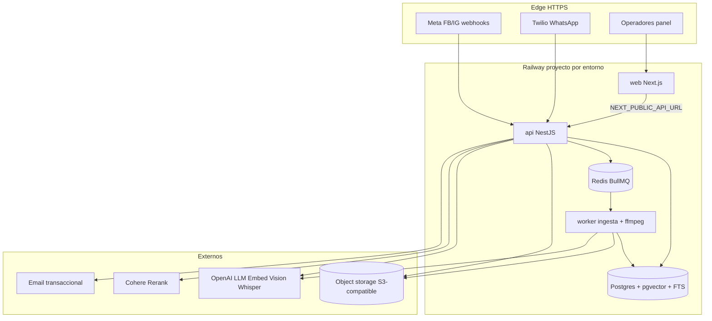

# Plan de implementación — infraestructura del chatbot Agentic RAG

Plan **accionable y ordenado** para llevar a producción la infraestructura que sostiene el chatbot Agentic RAG multimodal (OpenAI + Cohere, Nest/Next/Railway). Complementa el contrato de stack en [01-stack-y-entornos.md](01-stack-y-entornos.md); no lo sustituye.

**Alcance:** solo infraestructura y ops (runtime, secretos, entornos, observabilidad, capacity, CI/deploy, fases, riesgos). Contratos de dominio: [../backend/02-orquestador-agentico.md](../backend/02-orquestador-agentico.md), [07](../backend/07-pipeline-openai-y-proveedores.md), [08](../backend/08-ingesta-multimodal.md), [09](../backend/09-aceptacion-y-matriz-tests.md). Gate de salida a prod del bot: [../setup/09-criterios-salida-produccion-chatbot.md](../setup/09-criterios-salida-produccion-chatbot.md).

**Estado del workspace (orientativo, 2026-07-28):**

| Artefacto | Estado |
|---|---|
| Compose local (Postgres/Redis/MinIO u equivalente) | **Existe** (dev) |
| `railway.toml` / servicios Railway | **Parcial** |
| GitHub Actions (CI con pgvector) | **Ausente** — ver [../github/03-actions-ci-cd.md](../github/03-actions-ci-cd.md) |
| Worker dedicado + ffmpeg en imagen | **Objetivo** (staging/prod obligatorio para video) |
| Object storage prod (bucket aislado) | **Objetivo** — Must antes de UAT multimodal |

---

## 1. Objetivo y Definition of Done de infra (chatbot)

La infra del chatbot está lista cuando:

1. **API NestJS** recibe webhooks Meta/Twilio, ejecuta orquestador Agentic RAG y persiste CRM/telemetría.
2. **Worker de ingesta** consume cola BullMQ, parsea MIME, embebe, invalida versiones y (video) usa **ffmpeg**.
3. **PostgreSQL + pgvector + FTS** operan CRM + vectores + metadatos de media en el mismo cluster v1.
4. **Redis + BullMQ** sostienen jobs con prioridad alta en publicar/archivar (SLA C4 &lt; 60 s).
5. **Object storage S3-compatible** guarda binarios; DB solo `storageKey` + MIME + checksum.
6. Secretos OpenAI / Cohere / S3 / Meta / Twilio / JWT están **separados por entorno**.
7. Observabilidad: logs estructurados + métricas orquestador + alertas cola &gt; 60 s y fallo LLM/rerank/storage.
8. Health/readiness verdes; Railway/Nixpacks (o build documentado) desplegando `web` + `api` + `worker`.
9. CI aplica migraciones contra **Postgres+pgvector** efímero; PR **sin** claves prod ni `@live` OpenAI/Cohere.

**No es DoD de infra:** UAT firmado G1–G11, capacitación, ni aceptación C3/C5 de transcripts — eso vive en [../setup/09-criterios-salida-produccion-chatbot.md](../setup/09-criterios-salida-produccion-chatbot.md) y [../producto/02-fases-golive.md](../producto/02-fases-golive.md).

---

## 2. Stack runtime — componentes y responsabilidades

### 2.1 Matriz de servicios

| Componente | Runtime | Rol para el chatbot | Dependencias |
|---|---|---|---|
| **API NestJS** | Servicio Railway `api` | Webhooks, orquestador, tools Prisma, auth panel, enqueue ingesta, upload K | Postgres, Redis, OpenAI, Cohere, S3, Meta/Twilio |
| **Worker ingesta** | Servicio Railway `worker` (misma build `api`, comando distinto) | Chunk/embed/FTS, parsers MIME, Vision/Whisper, **ffmpeg**, invalidación | Redis/BullMQ, Postgres, OpenAI, S3, ffmpeg binario |
| **Panel Next.js** | Servicio Railway `web` | Superficies ops; no ejecuta LLM | API HTTPS |
| **PostgreSQL + pgvector** | Plugin Railway o contenedor `pgvector/pgvector` | Transaccional + vectores + FTS + `EventoOperativo` | Extensión `vector` + config FTS ES |
| **Redis** | Plugin Railway | Broker BullMQ; opcional cache corta | — |
| **Object storage** | S3 / R2 / MinIO (local) | Fuentes K + adjuntos lead | Credenciales IAM mínimas |
| **Email** (opcional pactado) | SMTP / Resend / SES | Alertas calificado/escalación | No bloquea bot text-only |

### 2.2 Diagrama de despliegue (objetivo)

### 2.3 Cola BullMQ — colas y prioridades

| Cola / job | Prioridad | Trigger | SLA a `listo` | Alerta |
|---|---|---|---|---|
| `documento.publicado` | **Alta** | Admin publica K | Texto/PDF/Word/XLS/foto: &lt; **60 s** (C4); video: &lt; **5 min** a transcript indexable (producto) | Job &gt; 60 s (texto/media corta) o &gt; 5 min (video) |
| `documento.archivado` | **Alta** | Archivar | Invalidación inmediata + job corto | Fallo persistente |
| `adjunto.lead` | Normal | Media entrante canal | No publica K global | Fallo Vision/S3 |
| Catálogo precios | **Síncrono DB** | Import/publicar precio | Sin cola de embeddings | N/A |

`QUEUE_DRIVER`:

| Valor | Cuándo |
|---|---|
| `inline` | Solo smoke local temprano / v0 sin worker |
| `bullmq` | **Obligatorio** staging/prod con ingesta multimodal y frescura medible |

### 2.4 Worker + ffmpeg + límite video

| Requisito | Detalle |
|---|---|
| Imagen worker | Debe incluir binario **ffmpeg** (o `FFMPEG_PATH`) |
| Flujo video | Extraer audio → `TranscriptionPort` (Whisper) → chunk/embed; frames Vision solo si política lo habilita |
| Límite duración | Video conocimiento / adjunto indexable: **máx. 5 min** de contenido útil (rechazo o recorte documentado si excede) |
| Límite tamaño | ≤ **100 MB** (D-MED-12); exceso → `PAYLOAD_TOO_LARGE` |
| CI | T-MED-VID puede **skip** si no hay ffmpeg; staging/prod **no** pueden skippear para U-MED-7 |
| Fallo | Job `error` + alerta; **no** versión searchable a medias (D-MED-13) |

---

## 3. Secretos y configuración (inventario operativo)

Nombres alineados a [../github/04-entornos-secretos-gobierno.md](../github/04-entornos-secretos-gobierno.md) y [../backend/07-pipeline-openai-y-proveedores.md](../backend/07-pipeline-openai-y-proveedores.md). **Nunca** valores en git.

### 3.1 Grupos Must para chatbot operable

| Grupo | Variables (nombres) | Staging | Prod | Notas |
|---|---|---|---|---|
| DB / cola | `DATABASE_URL`, `REDIS_URL`, `QUEUE_DRIVER=bullmq` | Distintos | Distintos | No compartir cluster staging↔prod |
| OpenAI | `OPENAI_API_KEY`, modelos orchestrator/generator/embedding/vision/whisper | Proyecto UAT | Proyecto prod | Preferir `OPENAI_PROJECT_ID` por entorno |
| Cohere | `COHERE_API_KEY`, `RERANK_THRESHOLD=0.85` | Sí | Sí | Sin Cohere → **no** go-live RAG (C5) |
| S3 | `S3_BUCKET`, `S3_ACCESS_KEY_ID`, `S3_SECRET_ACCESS_KEY`, `S3_REGION`, `S3_ENDPOINT` | Bucket UAT | Bucket prod | Obligatorios D-KNW-10 / INF-13 |
| Meta | `META_APP_SECRET`, `META_VERIFY_TOKEN`, `META_PAGE_ACCESS_TOKEN`, … | Apps de prueba | Prod | Firma webhook |
| Twilio | `TWILIO_AUTH_TOKEN`, `TWILIO_ACCOUNT_SID`, `TWILIO_WHATSAPP_FROM`, … | Sandbox/test | Prod | Etapa 9 / mismo corte |
| Auth panel | `JWT_SECRET` (o sesión) | Sí | Sí | Rotación → re-login |
| Worker | `FFMPEG_PATH` (si no está en `PATH`) | Sí | Sí | |
| Cupo | `CUPO_MENSUAL_MENSAJES=1000`, soft/hard AI tokens | Sí | Sí | Jardín 1 |
| Feature flags | `FF_BOT_ENABLED` (o equivalente), `FF_DEVOLVER_A_BOT=false` | Control UAT | Default on + kill switch | Ver rollback en setup/09 |
| Sede | `ACTIVE_SEDE_*` / config Jardín 1 | Jardín 1 | Jardín 1 | Jardín 2 **no** operable |

### 3.2 Reglas de gobernanza

1. Secretos solo en Railway Variables + GitHub Environments (`staging` / `production`); fuente de verdad Medina (Vault/Doppler/etc.) si se adopta.
2. CI PR: **mocks** de OpenAI/Cohere/Storage; cero inyección de keys prod.
3. `@live` solo en staging (o job nightly acotado), nunca en cada PR.
4. Rotación documentada: OpenAI/Cohere/S3/JWT/Meta/Twilio — checklist post-rotación (smoke health + un mensaje bot + un job publish).
5. Cambiar `OPENAI_EMBEDDING_MODEL` o dimensión ⇒ **reindex completo** del entorno (riesgo §11).

---

## 4. Entornos local / staging / prod

| Dimensión | **local (dev)** | **staging** | **prod** |
|---|---|---|---|
| Propósito | Desarrollo + smoke Compose | UAT Tres Cielos + `@live` media | Go-live Jardín 1 |
| Compose | Postgres pgvector, Redis, MinIO (o fake FS) | No (Railway) | No |
| API / worker / web | Local o tunnel | Railway proyecto staging | Railway proyecto prod (o isolation fuerte) |
| DB / Redis / bucket | Locales | Aislados UAT | Aislados prod |
| Meta / Twilio | Tokens test + ngrok | Apps/números de prueba | Prod; URL HTTPS estable |
| OpenAI / Cohere | Keys sandbox / cuota baja | Keys UAT | Keys prod + alertas billing |
| Seed / catálogo | Seeds + fixtures knowledge | Biblioteca UAT firmable | K mínimo G8 + catálogo vigente |
| `QUEUE_DRIVER` | `inline` o `bullmq` | `bullmq` | `bullmq` |
| ffmpeg | Recomendado en imagen/devcontainer | **Obligatorio** worker | **Obligatorio** worker |
| Deploy | Manual | Push `main` o dispatch | Tag `v*` + aprobación GH Environment |

**Aislamiento duro:** no compartir vectores, objetos S3, ni contadores de cupo entre staging y prod.

---

## 5. Observabilidad

### 5.1 Logs estructurados (campos mínimos)

| Contexto | Campos / eventos |
|---|---|
| Webhook | canal, messageId, firma OK/FAIL, latencia ingest |
| Orquestador | `ruta` (guion/tools/RAG/handoff/safe), tools invocados, latencias |
| RAG | scores rerank, umbral, IDs fragmento, `RegistroRecuperacion` |
| Precio | tool catalog + `RegistroConsultaCatalogo`; **nunca** monto desde OCR |
| Jobs | jobId, MIME, estados D-MED-4, duración, error code |
| Media | Vision/Whisper/S3/ffmpeg fail |
| Cupo | incremento unidad, mes, sede |

### 5.2 Métricas del orquestador (producto + ops)

| Métrica | Uso |
|---|---|
| Latencia p50/p95 respuesta bot | NF rendimiento |
| Tasa por `ruta` | Detectar degradación a safe/handoff |
| Tasa handoff (rerank bajo / sin catálogo / humano) | C5 ops |
| Errores OpenAI / Cohere / S3 / ffmpeg | Alertas |
| Duración jobs publish (p50/p95) | C4 / cola |
| Profundidad cola BullMQ + age del job más viejo | Capacidad |
| Cupo msgs consumidos / 1000 | Membresía |

Vendor de métricas **no amarrado** (Railway metrics, Grafana Cloud, etc.). El contrato de producto es `EventoOperativo` + panel Telemetría (F7).

### 5.3 Alertas Must (ops Medina)

| Alerta | Condición | Acción |
|---|---|---|
| **Cola atrasada** | Job publish `age` o time-to-`listo` **&gt; 60 s** (no-video) de forma sostenida | Revisar worker/Redis/OpenAI embeddings; no silenciar en UAT |
| **Video lento** | Job video **&gt; 5 min** sin `listo`/`error` | Capacidad ffmpeg/Whisper; rechazar videos fuera de política |
| **LLM fail** | Tasa error OpenAI (orquestador/generator) &gt; umbral o circuit open | Degradar a safe/handoff; **no** inventar; page on-call Medina |
| **Rerank fail** | Cohere down / 5xx | Misma degradación C5 (safe + handoff) |
| **Storage fail** | S3 put/get error sostenido | Bloquear publish nuevos; jobs `error` |
| **Webhook fail** | Firma inválida o 5xx sostenido Meta/Twilio | Verificar secretos y URL |
| **Cupo** | ≥ 80 % / 100 % del tope mensual | Aviso admin/coord |

Canal: el acordado en membresía (email/Slack); **sin** SIEM 24/7 en base (INF-12).

---

## 6. Capacity y costos (orientación v1)

### 6.1 Carga esperada

| Parámetro | Valor v1 |
|---|---|
| Jardines activos | **1** (Jardín 1) |
| Cupo mensajería | **~1 000 msgs/mes** |
| Concurrente típico | Bajo (picos de campaña, no SaaS masivo) |
| Cuello de botella | Latencia LLM / Vision / Whisper / rerank; CPU ffmpeg en worker al publicar video |

Footprint orientativo: 1× API + 1× worker + Postgres gestionado + Redis + 1 bucket. Escalar worker antes que API si la cola de ingesta crece.

### 6.2 Costos Vision / Whisper (orden de magnitud)

| Capacidad | Disparador | Nota de costo |
|---|---|---|
| LLM orquestador + generator | Casi cada msg bot | Dominante en ~1k msgs si hay RAG frecuente |
| Embeddings | Publish K + query RAG | Pico en reindex; estable en ops diaria |
| Cohere Rerank | Cada ruta RAG | Obligatorio C5; costo por query |
| **Vision** | Foto K o página raster / adjunto | Costoso por imagen; limitar tamaño ≤ 8 MB y frecuencia publish |
| **Whisper** | Video ≤ 5 min | Costo ∝ minutos audio; acotar uploads video en UAT/prod |
| S3 | Storage + PUT/GET | Bajo a esta escala; cuidado con videos 100 MB |

**Política:** preferir PDF/Word texto sobre foto/video para el mismo contenido; video solo cuando el valor de producto lo justifique. Soft limit de tokens AI con alerta admin ([backend/07](../backend/07-pipeline-openai-y-proveedores.md) §4.2).

### 6.3 Presupuesto ops pre go-live

| Ítem | Acción |
|---|---|
| Billing OpenAI | Proyecto separado staging vs prod; alertas de gasto |
| Billing Cohere | Idem |
| Railway | Monitoreo de uso CPU worker en jobs video |
| Restore drill | 1 restore Postgres pre go-live (INF-5 / INF-10) |

---

## 7. Health, readiness y probes Railway

| Endpoint | Servicio | Semántica |
|---|---|---|
| `GET /health` | API | Proceso vivo; **sin** secretos |
| `GET /health/ready` | API | DB OK; Redis OK si `QUEUE_DRIVER=bullmq`; opcional ping S3 `exists` de health object |
| `GET /` o `/api/health` | Web | Panel responde |
| Worker | Probe Railway / heartbeat | Proceso consume cola; opcional métrica `bullmq:active` |

Configurar healthcheck HTTP Railway en `api` → `/health`. Readiness debe fallar el deploy si migrate dejó DB inconsistente.

---

## 8. Railway / Nixpacks y topología de build

Referencia operativa: [../setup/07-railway-deploy.md](../setup/07-railway-deploy.md).

| Servicio | Build (objetivo) | Start | Notas Nixpacks / Docker |
|---|---|---|---|
| `web` | `pnpm install && pnpm --filter web build` | `pnpm --filter web start` | Node; `NEXT_PUBLIC_*` en build |
| `api` | `pnpm install && pnpm --filter api build` | migrate deploy + `start:prod` | Sin ffmpeg obligatorio en API |
| `worker` | **Misma** build que api | `start:worker` | Imagen **con ffmpeg** (Dockerfile o apt en Nixpacks/`railway.toml` build command) |
| Postgres | Plugin o imagen `pgvector/pgvector:pg16` | — | `CREATE EXTENSION vector` |
| Redis | Plugin | — | |

Si Nixpacks no instala ffmpeg de forma fiable → **Dockerfile** dedicado al worker (recomendado para D-MED-9).

Checklist primer entorno chatbot-ready:

- [ ] Plugins Postgres + Redis linked
- [ ] Extensión `vector` verificada
- [ ] Bucket S3 del entorno + vars
- [ ] Servicios `api`, `worker`, `web` verdes
- [ ] `/health` + `/health/ready` 200
- [ ] Smoke: enqueue job dummy → worker ACK
- [ ] Smoke: 1 llamada OpenAI + 1 Cohere Rerank (staging)
- [ ] Ningún secreto en repo

---

## 9. CI con pgvector (objetivo Actions)

Alineado a [../github/03-actions-ci-cd.md](../github/03-actions-ci-cd.md). **Hoy: sin workflows.**

| Job | Qué valida para el chatbot |
|---|---|
| lint / typecheck / test | Orquestador mock, scrub tariff, guards |
| `prisma-validate` + migrate en service `pgvector/pgvector` | Migraciones + extensión vector |
| build api + web | Artefactos desplegables |
| docker build worker | Imagen con ffmpeg (o stage que lo verifique) |
| **No** en PR | `@live` OpenAI/Cohere; migrate a staging/prod; seeds destructivos |

Gates merge Must: tests anti-alucinación / handoff / scrub ≥ umbrales de [backend/09](../backend/09-aceptacion-y-matriz-tests.md).

---

## 10. Fases de implementación de infra (ordenadas)

### Fase I0 — Cimientos locales

| # | Entregable | Criterio de salida |
|---|---|---|
| I0.1 | Compose: Postgres **pgvector**, Redis, MinIO | `psql` → `\dx` muestra `vector` |
| I0.2 | Vars `.env` local gitignored (nombres del §3) | API arranca en modo degradado sin keys IA |
| I0.3 | Health/ready locales | 200 contra DB±Redis |
| I0.4 | Documentar puertos (web 3010, api 3011, etc.) | Alineado setup/05 |

### Fase I1 — Cola y worker

| # | Entregable | Criterio de salida |
|---|---|---|
| I1.1 | `QUEUE_DRIVER=bullmq` + Redis | Job de prueba completado |
| I1.2 | Proceso worker separado | Logs de consumo visibles |
| I1.3 | Prioridad alta publish/archive | Métrica age &lt; 60 s en smoke texto |
| I1.4 | Alert hook stub (log/email) si job &gt; 60 s | Disparado en test de timeout |

### Fase I2 — Storage + media toolchain

| # | Entregable | Criterio de salida |
|---|---|---|
| I2.1 | `StoragePort` → MinIO/S3 | put/getSignedUrl/delete |
| I2.2 | Allowlist MIME + límites tamaño | 422/413 según D-MED |
| I2.3 | Worker con **ffmpeg** | `ffmpeg -version` en runtime worker |
| I2.4 | Política video **≤ 5 min** | Rechazo o error documentado si excede |

### Fase I3 — Proveedores IA en staging

| # | Entregable | Criterio de salida |
|---|---|---|
| I3.1 | OpenAI keys staging + modelos fijados | Orquestador responde safe sin inventar |
| I3.2 | Cohere + umbral 0.85 | Rerank scores en log/`RegistroRecuperacion` |
| I3.3 | Vision + Whisper en staging | T-MED-IMG/VID `@live` selectivo |
| I3.4 | Alertas LLM fail + cola | Canal Medina recibe prueba |

### Fase I4 — Railway staging chatbot-ready

| # | Entregable | Criterio de salida |
|---|---|---|
| I4.1 | Completar `railway.toml` / servicios api+worker+web | Deploys verdes |
| I4.2 | Postgres pgvector en staging | Extensión + migrate deploy |
| I4.3 | Bucket S3 staging | Upload K desde panel |
| I4.4 | Webhooks Meta/Twilio test → URL staging | Firma OK |
| I4.5 | Observabilidad mínima | Sample logs + 1 alerta real |

### Fase I5 — CI y gobierno

| # | Entregable | Criterio de salida |
|---|---|---|
| I5.1 | `.github/workflows/ci.yml` + service pgvector | PR bloqueada si migrate falla |
| I5.2 | Environments GH `staging` / `production` | Secrets por env ([github/04](../github/04-entornos-secretos-gobierno.md)) |
| I5.3 | Deploy staging desde CI | Smoke post-deploy |
| I5.4 | Ruleset / protection `main` | Checks required |

### Fase I6 — Prod hardening (pre go-live bot)

| # | Entregable | Criterio de salida |
|---|---|---|
| I6.1 | Proyecto/servicios prod aislados | Sin datos UAT |
| I6.2 | Backup Postgres + **restore drill** | Acta RPO/RTO |
| I6.3 | Kill switch `FF_BOT_ENABLED` | Documentado en setup/09 |
| I6.4 | Billing alerts OpenAI/Cohere | Umbrales configurados |
| I6.5 | Checklist INF-* en verde | [setup/04](../setup/04-criterios-de-exito.md) §7 |

Tras I6, el **gate de negocio/UAT del chatbot** lo cierra [../setup/09-criterios-salida-produccion-chatbot.md](../setup/09-criterios-salida-produccion-chatbot.md), no este plan solo.

---

## 11. Checklist consolidado de infra (binario)

### 11.1 Pre-staging

- [ ] Compose local con pgvector + Redis + storage
- [ ] Extensión `vector` creada
- [ ] Migraciones Prisma aplican en limpio
- [ ] API health/ready
- [ ] Worker + BullMQ smoke
- [ ] ffmpeg en worker (local o imagen)
- [ ] Mocks IA en tests unitarios

### 11.2 Staging chatbot

- [ ] Railway api + worker + web
- [ ] `QUEUE_DRIVER=bullmq`
- [ ] S3 bucket staging + StoragePort
- [ ] OpenAI + Cohere configurados
- [ ] Meta/Twilio test firmando
- [ ] Alertas cola &gt; 60 s y LLM fail conectadas
- [ ] Publish documento texto &lt; 60 s
- [ ] Publish foto/video política (5 min / 100 MB) validado o explícitamente diferido con firma
- [ ] Jardín 2 no recibe leads
- [ ] Feature flag bot off probado

### 11.3 Prod (infra only)

- [ ] Aislamiento DB/Redis/S3/keys
- [ ] pgvector en prod
- [ ] Worker ffmpeg
- [ ] Backups + restore drill (RPO ≤ 24 h, RTO ≤ 8 h laborales — INF-10)
- [ ] CI verde en el tag de release
- [ ] Dominios HTTPS + CORS panel
- [ ] Cupo 1000 + telemetría eventos persistiendo
- [ ] Runbook rollback (API/worker/flag) enlazado

---

## 12. Riesgos y mitigaciones

| Riesgo | Impacto | Mitigación |
|---|---|---|
| **Keys mezcladas** staging↔prod o en git | Fuga, billing, datos cruzados | Environments separados; secret scanning; rotación inmediata |
| **Reindex embeddings** (cambio de modelo/dimensión) | Similitud rota; C5 degradado | Freeze de modelo en prod; re-ingesta completa planificada; no hot-swap |
| **RPO/RTO incumplido** | Pérdida leads/conversaciones | Backup diario verificado; restore drill pre go-live; RPO ≤ 24 h / RTO ≤ 8 h lab |
| Plugin Railway **sin pgvector** | RAG imposible | Imagen `pgvector/pgvector` o Postgres externo documentado |
| Worker **sin ffmpeg** en prod | Video roto; D-MED-9 fail | Dockerfile worker; check en CI/deploy |
| Cola **sin alerta** &gt; 60 s | C4 invisible | Métrica age + alerta Must |
| OpenAI/Cohere outage | Bot mudo o tentación de inventar | Degradación safe/handoff obligatoria; alerta LLM fail |
| Bucket ausente | D-KNW-10 / DoD-13 fail | Bloquear go-live multimodal (setup/09 NO-GO) |
| Reindex masivo + Vision/Whisper | Pico de costo | Ventana mantenimientos; soft limits; preferir texto |
| Jardín 2 mal configurado | Leads en sede no contratada | Config sede + test G7 en cada deploy prod |
| Nixpacks omite native deps | Build frágil worker | Preferir Docker para worker |

---

## 13. RPO / RTO y continuidad (v1)

| Objetivo | Valor sugerido v1 | Evidencia |
|---|---|---|
| **RPO** | ≤ **24 h** (backup diario Postgres) | Job backup + retención acuerdo comercial |
| **RTO** | ≤ **8 h** laborales ante fallo crítico DB | Runbook restore + drill firmado |
| Object storage | Versionado/replicación según vendor; keys de objetos en DB | Backup metadatos Postgres es crítico para `storageKey` |
| Redis | Efímero; jobs deben ser **reencolables** desde estado DB si se pierde broker | Idempotencia de jobs publish |

Fuera de alcance base: multi-AZ activo-activo, SIEM, guardia 24/7.

---

## 14. Dependencias documentales

| Doc | Uso |
|---|---|
| [01-stack-y-entornos.md](01-stack-y-entornos.md) | Contrato de componentes |
| [../setup/03-infraestructura-setup.md](../setup/03-infraestructura-setup.md) | Setup profundo inicial |
| [../setup/07-railway-deploy.md](../setup/07-railway-deploy.md) | Runbook Railway |
| [../setup/09-criterios-salida-produccion-chatbot.md](../setup/09-criterios-salida-produccion-chatbot.md) | Gate go-live bot |
| [../github/03-actions-ci-cd.md](../github/03-actions-ci-cd.md) | CI pgvector / deploy |
| [../github/04-entornos-secretos-gobierno.md](../github/04-entornos-secretos-gobierno.md) | Inventario secretos |
| [../backend/07](../backend/07-pipeline-openai-y-proveedores.md)–[09](../backend/09-aceptacion-y-matriz-tests.md) | IA, media, aceptación |
| [../backend/10-plan-implementacion-chatbot.md](../backend/10-plan-implementacion-chatbot.md) | Plan de ejecución Nest / fases A–F |
| [../frontend/09-plan-implementacion-chatbot-ui.md](../frontend/09-plan-implementacion-chatbot-ui.md) | Plan UI conversación / panel bot |
| [../producto/02-fases-golive.md](../producto/02-fases-golive.md) | G1–G11 |

---

## 15. Criterio de cierre de este entregable

Quedan documentados: stack runtime (API + worker + Redis/BullMQ + Postgres pgvector + object storage), inventario de secretos, matriz de entornos, observabilidad y alertas (cola &gt; 60 s / LLM fail), capacity ~1k msgs/mes y costos Vision/Whisper, ffmpeg y límite video 5 min, health/readiness, Railway/Nixpacks, CI pgvector, fases I0–I6, checklists, riesgos (keys, reindex, RPO/RTO) y diagrama mermaid de despliegue — alineados al Agentic RAG multimodal OpenAI+Cohere sobre Nest/Next/Railway.
