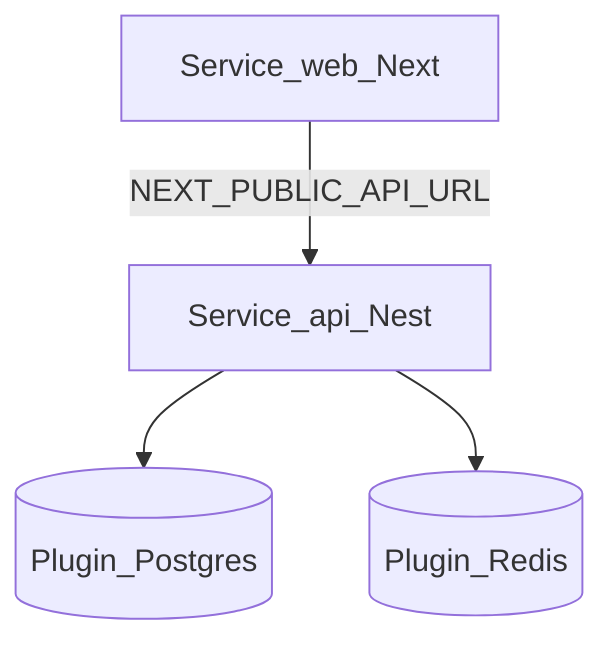

# Despliegue en Railway

Runbook para desplegar Event Master System (Tres Cielos) en **Railway**: frontend (`apps/web`), backend (`apps/api`) e infraestructura (Postgres + Redis).

Vendor elegido: **Railway** (cierra gap G-I2 del setup de infraestructura).

## 1. Arquitectura de servicios



| Servicio Railway | Root directory | Build | Start |
|---|---|---|---|
| `web` | `/` (filtro web) | `pnpm install && pnpm --filter web build` | `pnpm --filter web start` |
| `api` | `/` (filtro api) | `pnpm install && pnpm --filter api build` | `pnpm --filter api start:prod` |
| Postgres | Plugin | — | Proveído por Railway |
| Redis | Plugin | — | Proveído por Railway |

Config de referencia en el repo: [`railway.toml`](../../railway.toml) y/o variables por servicio en el dashboard.

Worker de ingesta (futuro): segundo servicio con la misma imagen/build de `api` y comando distinto (`start:worker`). En v0 no es obligatorio (`QUEUE_DRIVER=inline`).

## 2. Prerrequisitos

- [ ] Cuenta Railway + proyecto `tres-cielos-sys` (o nombre acordado)
- [ ] Repo conectado (GitHub `PMedinaGarcia/tres-cielos-sys` o remoto del equipo)
- [ ] CLI opcional: `npm i -g @railway/cli` + `railway login`
- [ ] Secretos listos (JWT, LLM, Meta, Twilio) — **no** para el primer smoke de health

## 3. Provisionar infra

1. Crear proyecto Railway.
2. Añadir **PostgreSQL**.
3. Añadir **Redis**.
4. Crear servicios `api` y `web` desde el mismo repo.

### 3.1 pgvector

Tras el primer deploy de DB:

```sql
CREATE EXTENSION IF NOT EXISTS vector;
```

Si el add-on Postgres de Railway **no** permite la extensión `vector`:

- Desplegar un servicio Docker con imagen `pgvector/pgvector:pg16` como base de datos, **o**
- Usar un provider Postgres externo con pgvector y apuntar `DATABASE_URL`.

Documentar la opción elegida en el README del proyecto Railway / nota de ops.

## 4. Variables de entorno

### 4.1 Servicio `api`

| Variable | Origen | Notas |
|---|---|---|
| `NODE_ENV` | `production` | |
| `APP_ENV` | `staging` \| `production` \| `sandbox` | |
| `PORT` | Railway inyecta | No fijar a 3011 en cloud |
| `DATABASE_URL` | Plugin Postgres | Referencia `${{Postgres.DATABASE_URL}}` |
| `REDIS_URL` | Plugin Redis | Referencia del plugin |
| `QUEUE_DRIVER` | `inline` (v0) o `bullmq` | |
| `CORS_ORIGINS` | URL pública del servicio `web` | CSV |
| `JWT_SECRET` | Secret manager / Railway secret | Obligatorio antes de auth real |
| `API_PREFIX` | vacío o `api/v1` | Alinear con FE |

Resto según [02-backend-setup](02-backend-setup.md) §3 cuando se activen canales/IA.

### 4.2 Servicio `web`

| Variable | Valor |
|---|---|
| `NODE_ENV` | `production` |
| `NEXT_PUBLIC_API_URL` | URL pública HTTPS del servicio `api` (sin slash final) |
| `NEXT_PUBLIC_APP_ENV` | `staging` / `production` / `sandbox` |
| `PORT` | Railway inyecta; Next `start` lo respeta si se configura |

### 4.3 Entorno sandbox / staging

| Entorno | Uso |
|---|---|
| `sandbox` | Pruebas de import XLS + tools de catálogo; secretos de prueba |
| `staging` | UAT producto |
| `production` | Jardín 1 |

**Aislamiento:** DB y Redis **no** se comparten entre sandbox/staging/prod. Preferir proyectos Railway separados o bases distintas.

## 5. Build y migraciones

En el servicio `api`, release / deploy command sugerido:

```bash
pnpm --filter api prisma migrate deploy && pnpm --filter api start:prod
```

O paso de release separado en Railway si está disponible.

Seed sandbox **solo** en no-prod:

```bash
pnpm --filter api sandbox:seed
```

## 6. Healthchecks

| Servicio | Path | Expectativa |
|---|---|---|
| `api` | `GET /health` | 200 |
| `api` | `GET /health/ready` | 200 si DB (± Redis) OK |
| `web` | `GET /` | 200 |

Configurar healthcheck HTTP en Railway apuntando a `/health` en `api`.

## 7. Dominios y CORS

1. Asignar dominio Railway o custom al `web` y al `api`.
2. Actualizar `CORS_ORIGINS` con el origen exacto del panel (HTTPS).
3. Actualizar `NEXT_PUBLIC_API_URL` y redesplegar `web` (vars `NEXT_PUBLIC_*` se hornean en build).

## 8. Webhooks (fases posteriores)

Meta/Twilio requieren URL pública HTTPS del `api`. En sandbox usar tokens de prueba. Tunnel local (ngrok) solo para dev en máquina, no para Railway.

## 9. Checklist de primer deploy

- [ ] Plugins Postgres + Redis linked al `api`
- [ ] `CREATE EXTENSION vector` OK (o alternativa documentada)
- [ ] Build `api` y `web` verdes
- [ ] Migraciones aplicadas
- [ ] `/health` y `/health/ready` 200
- [ ] Panel carga y puede llamar al API (CORS)
- [ ] (Sandbox) `sandbox:seed` + smoke tools
- [ ] Ningún secreto en el repo

## 10. Referencias

- [`railway.toml`](../../railway.toml)
- [05-escaneo-entorno-y-dependencias](05-escaneo-entorno-y-dependencias.md)
- [06-checklist-testeo-inicial](06-checklist-testeo-inicial.md)
- [../github/03-actions-ci-cd.md](../github/03-actions-ci-cd.md)
- [../github/04-entornos-secretos-gobierno.md](../github/04-entornos-secretos-gobierno.md)
