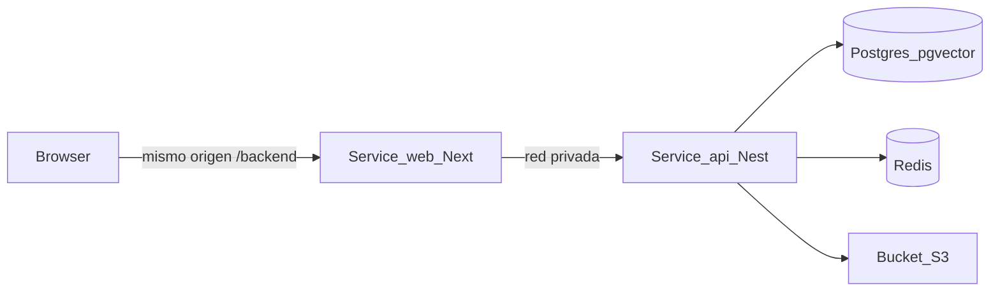

# Despliegue en Railway

Runbook para desplegar Event Master System (Tres Cielos) en **Railway**: frontend (`apps/web`), backend (`apps/api`) e infraestructura (Postgres + Redis + Storage Bucket).

Vendor elegido: **Railway** (cierra gap G-I2 del setup de infraestructura).

`railway.toml` / Config as Code está **deprecado**. La fuente de verdad es [`.railway/railway.ts`](../../.railway/railway.ts) (Infrastructure as Code). Comandos: `railway config plan` / `railway config apply`.

## 1. Arquitectura de servicios



| Servicio | Rol | Build / start |
|---|---|---|
| `web` | Next.js panel. Root del monorepo. | `pnpm --filter @tres-cielos/shared build` + `@tres-cielos/web` |
| `api` | NestJS. Root del monorepo. `PORT=3011` fijo. Imagen [`Dockerfile.api`](../../Dockerfile.api). | **preDeploy** `prisma:deploy`; start `node /app/apps/api/dist/src/main.js` |
| `postgres` | Plugin Railway | `CREATE EXTENSION vector` lo aplica la migración Prisma |
| `redis` | Plugin Railway | Listo para BullMQ; v0 usa `QUEUE_DRIVER=inline` |
| `media` | Storage Bucket S3-compatible | Credenciales vía `ref(media, …)` → `S3_*` |

El browser **no** llama al dominio público del API. El panel usa `NEXT_PUBLIC_API_URL=/backend` (proxy same-origin; Next.js ignora carpetas `_`) y `API_INTERNAL_URL=http://api.railway.internal:3011`. Así las cookies `tc_access` / `tc_refresh` (`SameSite=Lax`) quedan en el host del panel.

Worker de ingesta (futuro): segundo servicio con la misma build de `api` y comando `start:worker`. En v0 no es obligatorio.

## 2. Prerrequisitos

- [ ] Cuenta Railway (el CLI crea cuenta en el login si hace falta)
- [ ] CLI: `npm i -g @railway/cli` (o el installer de railway.com)
- [ ] Node ≥ 22 y `pnpm` en la máquina que corre `railway config`
- [ ] Paquete `railway` en el root del monorepo (devDependency; importa `railway/iac`)
- [ ] Secretos listos: `JWT_SECRET`, `OPENAI_API_KEY`, `AUTH_BOOTSTRAP_ADMIN_PASSWORD` — **nunca** en git

## 3. Provisionar con CLI

Desde la raíz del repo:

```bash
railway login
railway init --name tres-cielos-sys   # o railway link si el proyecto ya existe
railway config plan
railway config apply
```

`apply` crea `postgres`, `redis`, `media`, `api` y `web` según `.railway/railway.ts`.

### 3.1 Dominios públicos

```bash
railway domain --service api
railway domain --service web
```

Luego (valores reales, no en el IaC):

```bash
railway variable set CORS_ORIGINS=https://<web-domain> --service api
railway variable set PUBLIC_API_URL=https://<api-domain> --service api
railway variable set TWILIO_WEBHOOK_URL=https://<api-domain>/webhooks/twilio/whatsapp --service api
```

En `.railway/railway.ts` esas claves usan `preserve()` para no borrarlas en el siguiente apply.

### 3.2 Secretos

```bash
railway variable set JWT_SECRET=<aleatorio-32+> --service api
railway variable set OPENAI_API_KEY=... --service api
railway variable set AUTH_BOOTSTRAP_ADMIN_EMAIL=admin@trescielos.local --service api
railway variable set AUTH_BOOTSTRAP_ADMIN_PASSWORD=... --service api
# opcional
railway variable set COHERE_API_KEY=... --service api
```

### 3.3 pgvector

La migración `20260729050000_fase_a_cerebro` ejecuta `CREATE EXTENSION IF NOT EXISTS vector`.

Si el plugin Postgres **no** permite `vector`:

- Desplegar un servicio Docker `pgvector/pgvector:pg16`, **o**
- Apuntar `DATABASE_URL` a un Postgres externo con pgvector.

## 4. Variables de entorno

### 4.1 Servicio `api`

| Variable | Origen | Notas |
|---|---|---|
| `NODE_ENV` | `production` | IaC |
| `APP_ENV` | `staging` (UAT) o `prod` (Jardín 1) | Enum Zod: `dev` \| `staging` \| `prod` \| `test`. **No** usar `production`. |
| `PORT` | `3011` | Fijo para DNS privado `api.railway.internal:3011` |
| `DATABASE_URL` | Plugin Postgres | `db.env.DATABASE_URL` |
| `REDIS_URL` | Plugin Redis | `cache.env.REDIS_URL` |
| `QUEUE_DRIVER` | `inline` | `bullmq` cuando exista worker |
| `STORAGE_PROVIDER` | `s3` | Obligatorio en staging/prod |
| `S3_BUCKET` / `S3_ACCESS_KEY_ID` / `S3_SECRET_ACCESS_KEY` / `S3_ENDPOINT` | Bucket `media` | `S3_REGION=us-east-1` (el SDK no acepta `auto`) |
| `AI_PROVIDERS_MODE` | `live` | Exige `OPENAI_API_KEY` |
| `RAG_STORE` | `prisma` | pgvector + FTS |
| `CORS_ORIGINS` | URL HTTPS del `web` | Por si hay llamadas directas al API |
| `PUBLIC_API_URL` | URL HTTPS del `api` | Assets / webhooks |
| `JWT_SECRET` | Secret | `preserve()`; no el default de dev en `APP_ENV=prod` |
| `AUTH_COOKIE_SECURE` | `true` | HTTPS |

### 4.2 Servicio `web`

| Variable | Valor |
|---|---|
| `NODE_ENV` | `production` |
| `NEXT_PUBLIC_API_URL` | `/backend` (same-origin; **no** la URL pública del API) |
| `API_INTERNAL_URL` | `http://api.railway.internal:3011` |
| `NEXT_PUBLIC_APP_ENV` | `staging` |
| `NEXT_PUBLIC_DEFAULT_LOCALE` | `es-MX` |
| `PORT` | Lo inyecta Railway |

`NEXT_PUBLIC_*` se hornea en el **build**. Cambiar `/backend` exige redesplegar `web`.

### 4.3 Entornos de producto

| `APP_ENV` | Uso |
|---|---|
| `staging` | UAT; seed de admin + catálogo sandbox |
| `prod` | Jardín 1; JWT distinto al de dev; sin seed de catálogo |

El entorno de la **plataforma** Railway suele llamarse `production`. No es lo mismo que `APP_ENV=prod`.

**Aislamiento:** DB, Redis y bucket **no** se comparten entre staging y prod. Proyectos Railway separados.

## 5. Deploy de código

Sin GitHub conectado (primer corte):

```bash
railway up --service api --detach
railway up --service web --detach
```

No declarar éxito hasta `railway deployment list --service api` / `--service web` en `SUCCESS`.

Opcional después: `source: github("PMedinaGarcia/tres-cielos-sys")` en el IaC para deploys automáticos.

Seed **una vez** (el seed pisa el hash del admin si se repite):

```bash
railway run -s api pnpm --filter @tres-cielos/api prisma:seed
railway run -s api pnpm --filter @tres-cielos/api sandbox:seed   # solo staging
```

## 6. Healthchecks

| Servicio | Path | Expectativa |
|---|---|---|
| `api` | `GET /health` | 200 liveness |
| `api` | `GET /health/ready` | 200 si DB + Redis + S3 OK |
| `web` | `GET /health` | 200 (ruta pública; `/` redirige a `/login`) |

## 7. Dominios, CORS y auth

1. Dominio Railway (o custom) en `web` y `api`.
2. `CORS_ORIGINS` = origen exacto del panel (`https://…`).
3. Login del panel va a `/backend/auth/login` → proxy → API interno. No hace falta `SameSite=None`.

## 8. Webhooks

Meta/Twilio: URL pública HTTPS del `api` (`/webhooks/twilio/whatsapp`, verify Meta). Tokens de prueba en staging. ngrok solo en máquina local.

## 9. Checklist de primer deploy

- [ ] `railway config apply` creó postgres, redis, media, api, web
- [ ] Secretos seteados (`preserve()` en IaC)
- [ ] Dominios públicos + `CORS_ORIGINS` / `PUBLIC_API_URL`
- [ ] `CREATE EXTENSION vector` OK (o fallback documentado)
- [ ] Deploy `api` y `web` en `SUCCESS`
- [ ] `/health` y `/health/ready` 200
- [ ] Login del panel (cookies same-origin)
- [ ] (Staging) `prisma:seed` + `sandbox:seed`
- [ ] Ningún secreto en el repo

## 10. Referencias

- [`.railway/railway.ts`](../../.railway/railway.ts)
- [`Dockerfile.api`](../../Dockerfile.api) — imagen del API (Railpack no copia `dist/` gitignored)
- [05-escaneo-entorno-y-dependencias](05-escaneo-entorno-y-dependencias.md)
- [06-checklist-testeo-inicial](06-checklist-testeo-inicial.md)
- [../github/03-actions-ci-cd.md](../github/03-actions-ci-cd.md)
- [../github/04-entornos-secretos-gobierno.md](../github/04-entornos-secretos-gobierno.md)
- [Railway IaC](https://docs.railway.com/infrastructure-as-code)
