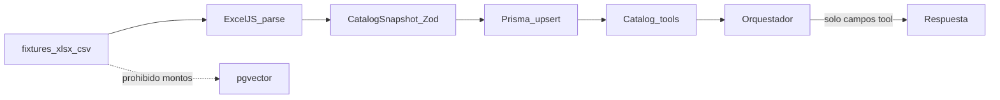

# Sandbox de catálogo XLS — contexto para el agente

Estrategia para que el **orquestador agentico** entienda correctamente datos de precios/paquetes provenientes de Excel/CSV: el modelo **nunca** razona sobre el archivo crudo; solo sobre resultados tipados de tools alimentados desde Prisma.

Contrato de dominio: [../database/02-catalogo-paquetes.md](../database/02-catalogo-paquetes.md). Orquestador: [../backend/02-orquestador-agentico.md](../backend/02-orquestador-agentico.md).

## 1. Problema que resuelve

| Mal patrón | Efecto |
|---|---|
| Pegar celdas Excel en el prompt | Alucinación de montos, SKUs mezclados, sin vigencia |
| Indexar hojas de precios en pgvector | El bot “cita” un fragmento y inventa o redondea |
| Dejar que el LLM estime si falta fila | Incumple anti-alucinación (0 % montos inventados) |

| Buen patrón (sandbox) | Efecto |
|---|---|
| Excel → parse → Zod `CatalogSnapshot` → Prisma | Una sola representación intermedia validada |
| Tools Prisma (`buscar_paquetes`, …) | Contexto del agente = JSON tipado de tool result |
| Eval golden | Regresión si el seed o tools divergen del fixture |

## 2. Pipeline



Reglas:

1. Validar SKU, tipos y fechas **antes** de escribir.
2. Filas inválidas → reporte `parcial` / `filas_error` (no silenciar).
3. Publicar es paso explícito (en sandbox seed se publican fixtures de prueba).
4. **No** crear `FragmentoVectorial` desde columnas de monto.
5. Narrativa opcional (`descripcion_larga`) puede ir a conocimiento K; **nunca** como sustituto del precio.

## 3. Contrato de hojas

### Paquetes

`sku`, `nombre`, `tipo_evento`, `sede`, `aforo_min`, `aforo_max`, `descripcion_corta`, `estado`

### Precios

`sku`, `moneda`, `monto`, `rango_min`, `rango_max`, `unidad`, `vigente_desde`, `vigente_hasta`, `condiciones`

### Inclusiones

`sku`, `categoria`, `nombre`, `cantidad`, `unidad`, `obligatoria`

### Reglas (opcional)

`sku`, `tipo`, `parametros_json`, `mensaje_prospecto`

Archivos de referencia: `fixtures/catalog/`.

## 4. `CatalogSnapshot` (contexto canónico)

Definido en `@tres-cielos/shared` (Zod). Es la **única** representación intermedia entre archivo y DB.

El agente **no** recibe el snapshot completo en el system prompt. Recibe:

- Instrucciones de política (usar tools; no estimar).
- Resultados de tools por turno (subconjuntos del catálogo ya filtrados).

Así el “contexto” del agente sobre XLS es **indirección tipada**, no el Excel.

## 5. Tools (contrato sandbox)

| Tool | Entrada | Salida |
|---|---|---|
| `buscar_paquetes` | `tipoEvento`, `sedeId?`, `aforo?`, `fecha?` | Lista publicados que cumplen |
| `obtener_precio_paquete` | `paqueteId` o `sku`, `fecha?` | Precio vigente o `sin_precio_vigente` |
| `listar_inclusiones` | `paqueteId` / `sku` | Inclusiones ordenadas |
| `comparar_paquetes` | `ids` máx. 3 | Diff precio/aforo/inclusiones |
| `evaluar_reglas_paquete` | `paqueteId`, `fecha?`, `aforo?` | Reglas + `mensaje_prospecto` |

Tras tool result, la redacción al lead usa **únicamente** campos devueltos.

## 6. Qué “entiende” el agente (checklist de diseño de prompts)

Al implementar el orquestador, el system/developer prompt debe incluir:

- [ ] “Los montos solo salen de tools de catálogo.”
- [ ] “Si la tool falla o viene vacía → safe reply o handoff; no inventar.”
- [ ] “No uses conocimiento documental (RAG) para cifras.”
- [ ] “Incluye SKU/nombre cuando cites precio.”
- [ ] “Vigencia: respeta `vigente_desde` / `vigente_hasta` del result.”

El sandbox evalúa la capa de **datos+tools** sin LLM obligatorio; los golden Q&A documentan la expectativa cuando el LLM esté cableado.

## 7. Fixtures y evaluación

| Artefacto | Path |
|---|---|
| Plantilla / sample XLSX | `fixtures/catalog/sample-catalog.xlsx` |
| CSV por hoja | `fixtures/catalog/csv/` |
| Golden snapshot JSON | `fixtures/catalog/golden-snapshot.json` |
| Casos Q&A | `fixtures/catalog/golden-qa.json` |

Comandos:

```bash
pnpm --filter api sandbox:seed
pnpm --filter api sandbox:eval
```

`sandbox:eval` comprueba que las tools, contra DB sembrada, devuelven montos/SKUs del golden (anti-regresión del pipeline XLS→contexto).

## 8. Relación con RAG

| Dato | Fuente |
|---|---|
| Precio, aforo, inclusiones tipadas, reglas | Catálogo Prisma + tools |
| Copy narrativo (“ambiente del jardín…”) | RAG / K documental **sin cifras** |

Excel de precios **no** es corpus de embeddings para montos.

## 9. Criterio de cierre del sandbox

- [ ] Pipeline parse → Zod → seed documentado y ejecutable
- [ ] Tools stub leen solo Prisma
- [ ] Golden eval verde
- [ ] Doc de prompts/política alineada a este archivo
- [ ] Railway/sandbox env puede sembrar fixtures sin tocar prod

Cuando el orquestador LLM se implemente, reutilizar estos golden como casos UAT de anti-alucinación (Criterios de cotización / D-CAT).
